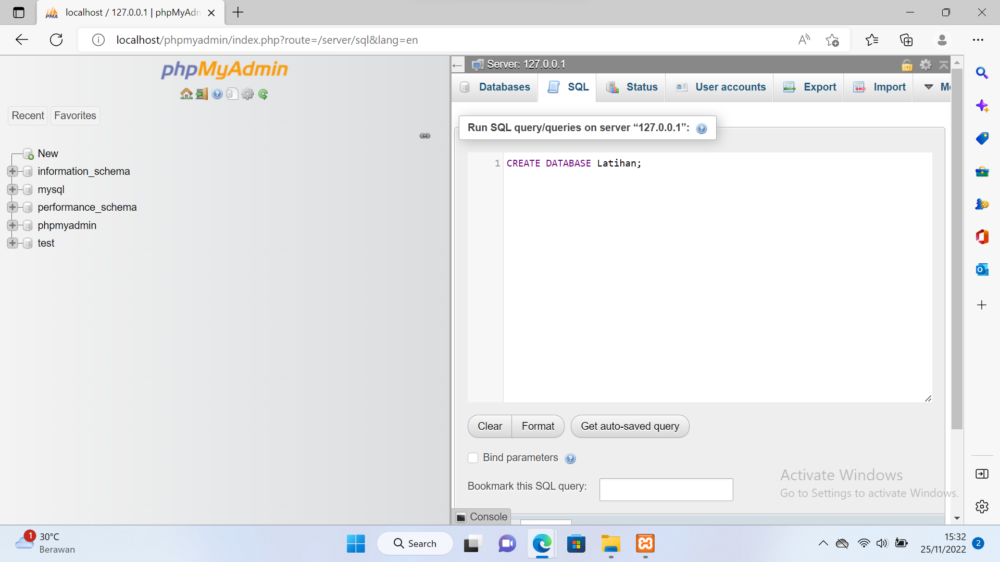
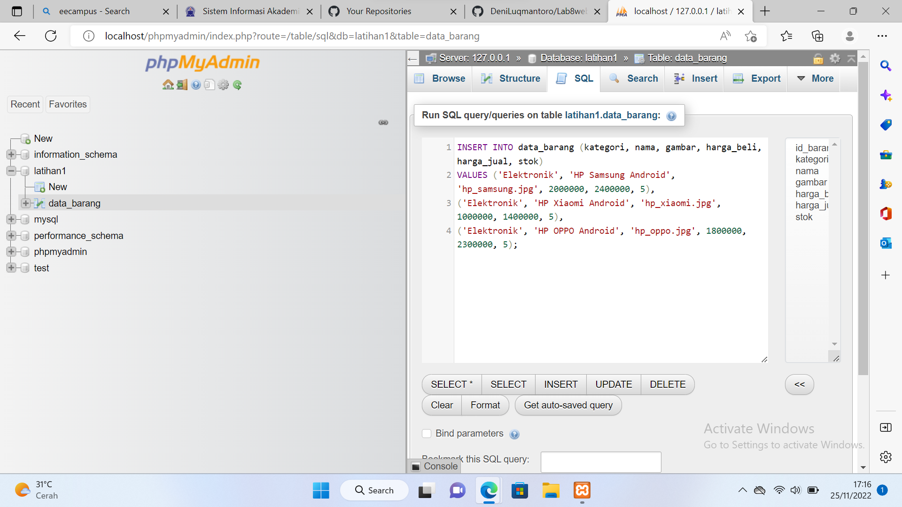
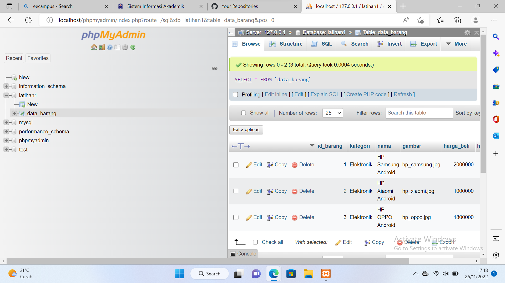
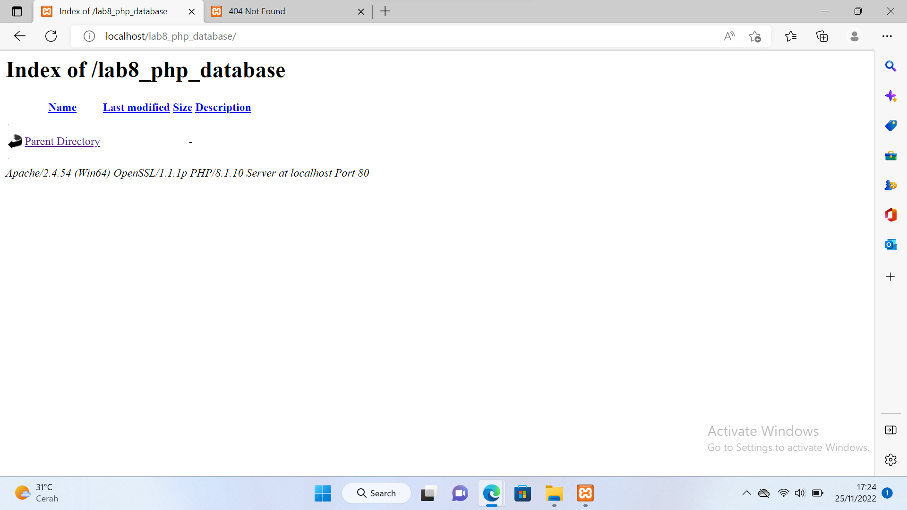
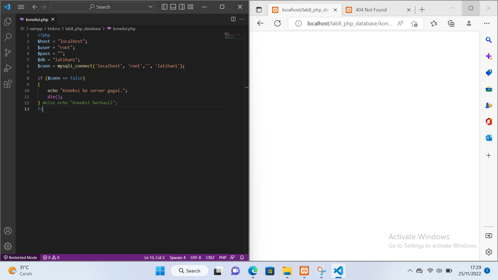
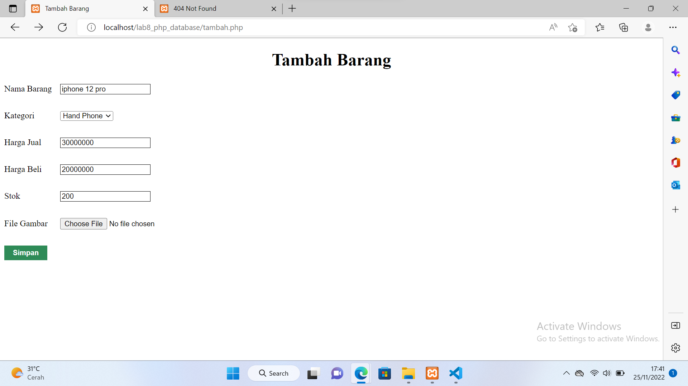
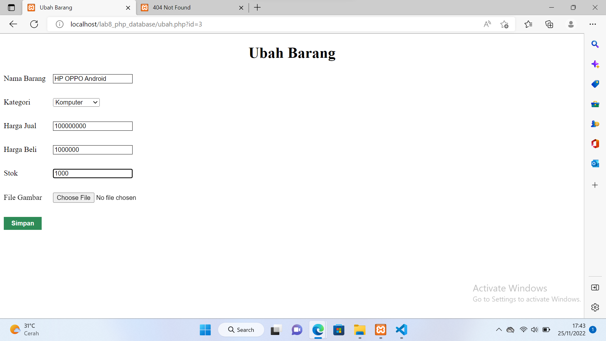
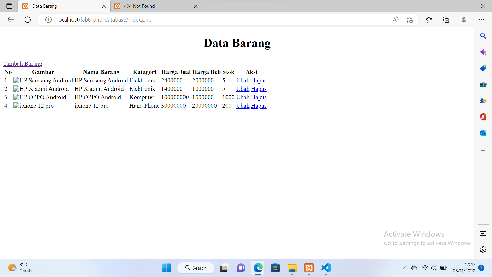

# Lab8web-php

<b>Nama	: Andre Mahadi

NIM		: 312110221

Kelas		: TI 21 B1

Matakuliah	: Pemrograman Web</b>

<b>Langkah-langkah praktikum</b>

1.	Menjalankan mysql server dengan aplikasi xampp, kemudian start apache dan mysql.
 

2.	Akses mysql Client menggunakan PHP MyAdmin melalui browser dengan link http://localhost/phpmyadmin/ 
 

3.	Membuat database dengan nama Latihan 1.
 
 

4.	Membuat tabel pada database Latihan 1 dengan syntax berikut.

CREATE TABLE data_barang (

id_barang int(10) auto_increment Primary Key,

kategori varchar(30),

nama varchar(30),

gambar varchar(100),

harga_beli decimal(10,0),

harga_jual decimal(10,0),

stok int(4)

);
 
 

5.	Kemudian tambahkan data pada tabel data_barang.

 

6.	Tampilkan field dan record tabel dengan query SELECT * FROM data_barang;

 

7.	Membuat program CRUD (Create, Read, Update, Delete)
Buat folder lab8_php_database pada root directory web server (c:\xampp\htdocs)
 

8.	Kemudian untuk mengakses direktory tersebut pada web server dengan mengakses URL:
http://localhost/lab8_php_database/ 
 

9.	Membuat file koneksi dengan ekstension php dan beri nama dengan koneksi.php pada folder lab8_php_database.
10.	Buka melalui browser untuk melakukan uji koneksi database, jika koneksi berhasil akan muncul pesan koneksi berhasil melalui perintah echo “koneksi berhasil”;
 

11.	Disini saya akan mencoba dengan mengkombinasi antara CSS dan Bootstrap 5 yang telah saya simpan pada folder lab8_php_database
12.	Membuat file Read dengan ekstension php dan beri nama dengan index.php pada folder lab8_php_database.
Simpan dan buka pada browser dengan link localhost/lab8_php_database/index.php

13.	Membuat file tambah data (create) dengan ekstension php dan beri nama dengan tambah.php pada folder lab8_php_database.
Simpan dan buka pada browser dengan klik tombol tambah barang atau dengan link localhost/lab8_php_database/tambah.php
Saya mencoba melakukan penambahan barang seperti pada gambar diatas, kemudian simpan dan lihat hasilnya.

14.	Membuat file ubah data (update) dengan ekstension php dan beri nama dengan ubah.php pada folder lab8_php_database.
Simpan dan buka pada browser dengan klik tombol ubah atau dengan link localhost/lab8_php_database/ubah.php
Disini saya melakukan perubahan data pada  harga barang dan stok barang, kemudian simpan dan lihat hasilnya.
 
